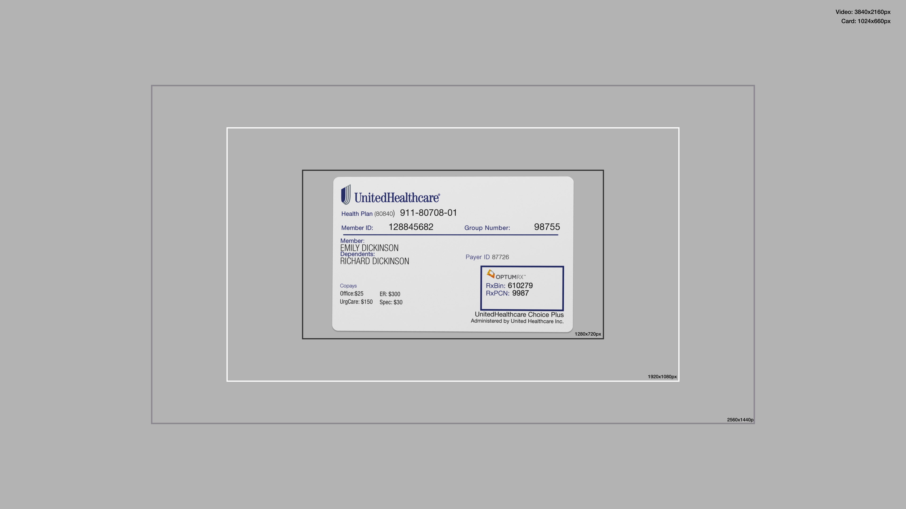

# CardScan.ai - Testing Resources


This repository contains sample health insurance cards and videos for manual and automated testing. It is designed to assist developers and testers in validating the functionality of card scanning and detection software.

## Repository Structure

The repository is organized into two main directories:

- `insurance-card-images`: Contains images and PDFs of sample health insurance cards.
- `insurance-test-videos`: Contains sample videos and images in various resolutions for testing video processing capabilities.

### Card Images

The `insurance-card-images` directory includes the following files:

- `uhc_front.png`: Front image of a UnitedHealthcare insurance card.
- `uhc_back.png`: Back image of a UnitedHealthcare insurance card.
- `uhc.pdf`: PDF containing both front and back images of a UnitedHealthcare insurance card.
- `cigna_front.png`: Front image of a Cigna insurance card.
- `cigna_back.png`: Back image of a Cigna insurance card.
- `cigna.pdf`: PDF containing both front and back images of a Cigna insurance card.
- `humana_front.png`: Front image of a Humana insurance card.
- `humana_back.png`: Back image of a Humana insurance card.
- `humana.pdf`: PDF containing both front and back images of a Humana insurance card.

### Test Videos




The `insurance-test-videos` directory includes a `videos.zip` file containing sample videos in various resolutions for testing video processing capabilities. The available resolutions are:

- `4k.y4m`: Sample video in 4K resolution.
- `2k.y4m`: Sample video in 2K resolution.
- `1440p.y4m`: Sample video in 1440p resolution.
- `1080p.y4m`: Sample video in 1080p resolution.
- `720p.y4m`: Sample video in 720p resolution.

Each of these videos contains a centered card image and bounding boxes at 720p, 1080p, and 1440p for alignment testing.

These videos can be used to test the performance and accuracy of video processing algorithms at different resolutions.

The folder also contains screen capture images in each of the resolutions.


## Usage

These resources can be used for manual testing by visually inspecting the images and videos or for automated testing by integrating them into your test suites. Ensure that your card scanning and recognition software can accurately process and extract information from these samples.

### Using Fake Webcam with Chrome

To use a fake webcam with Chrome for testing, you can launch Chrome with the following command line flags:

```sh
./chrome --use-fake-device-for-media-stream --use-file-for-fake-video-capture=./insurance-test-videos/1440p.y4m
```

This command will start Chrome with a fake webcam device, using the specified video file (1440p.y4m in this example) as the input for the fake webcam. You can replace 1440p.y4m with any other video file from the insurance-test-videos directory to test with different resolutions.

### Cypress Testing
To use the sample videos with Cypress for testing, you can modify the `plugins/index.js` file in your Cypress project as follows:

```js
module.exports = (on, config) => {
  on('before:browser:launch', (browser = {}, launchOptions) => {
    if (browser.family === 'chromium' && browser.name !== 'electron') {
      if (process.env.CYPRESS_WEBCAM_VIDEO_PATH) {
        console.log("Setting Video to be: ", process.env.CYPRESS_WEBCAM_VIDEO_PATH)
        launchOptions.args.push(
          `--use-file-for-fake-video-capture=${process.env.CYPRESS_WEBCAM_VIDEO_PATH}`
        )
      }
    }
    return launchOptions
  })
}
```

This modification allows you to specify the path to a video file to be used as the fake webcam input for Cypress tests. You can set the environment variable `CYPRESS_WEBCAM_VIDEO_PATH` to the path of the desired video file before running your tests. For example:

```
CYPRESS_WEBCAM_VIDEO_PATH=./insurance-test-videos/1440p.y4m cypress open
```

This command will run Cypress with the 1440p.y4m video file as the fake webcam input.


## Contributing

Contributions to this repository are welcome. Please feel free to add more sample cards or videos by submitting a pull request.

## License

This project is licensed under the MIT License - see the [LICENSE](LICENSE) file for details.
